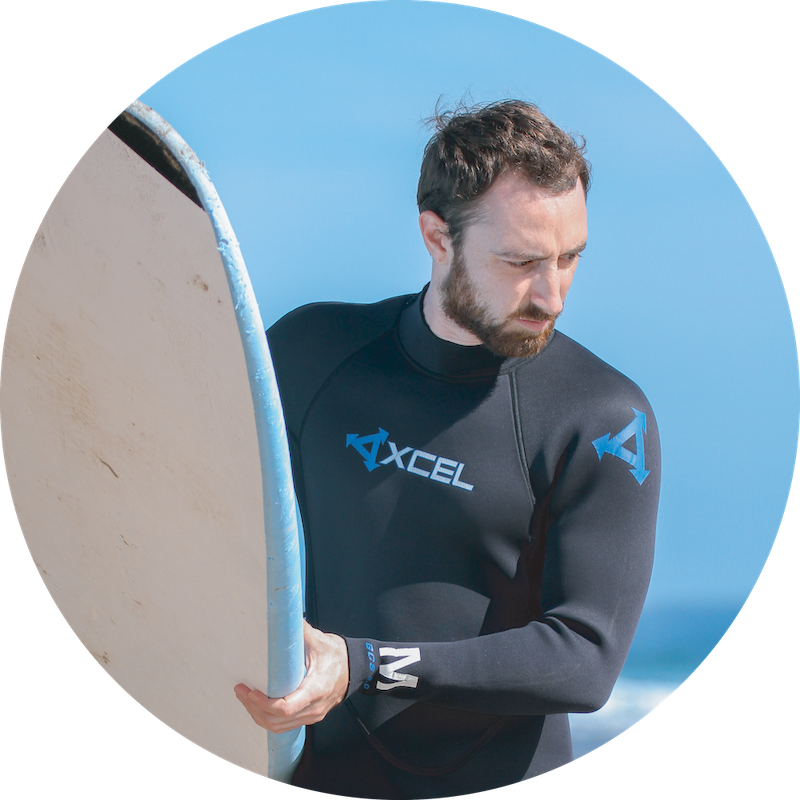

{:refdef: style="text-align: center;"}
{:height="300px"}
{: refdef}

# About me

I'm a Full-Stack Software Engineer passionate about mobile and game development. 
iOS Developer since 2010, interested in IoT, Embedded systems and AI, comfortable with languages such as C, C++, C#, Dart, Go, JavaScript, Java, Python and Swift.

{:refdef: style="text-align: center;"}
[{:height="64px"}](https://www.linkedin.com/in/pasquale-ambrosini-77764531/)
&nbsp;
&nbsp;
&nbsp;
&nbsp;
[{:height="64px"}](https://github.com/pascalbros)
&nbsp;
&nbsp;
&nbsp;
&nbsp;
[{:height="64px"}](https://twitter.com/PascalAmbro)
&nbsp;
&nbsp;
&nbsp;
&nbsp;
[{:height="64px"}](mailto:pasquale.ambrosini@gmail.com)
{: refdef}